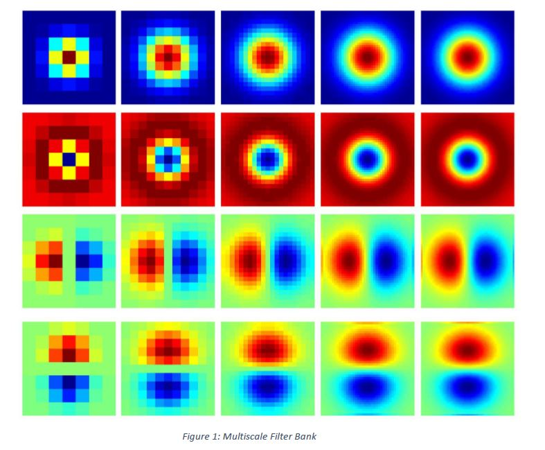
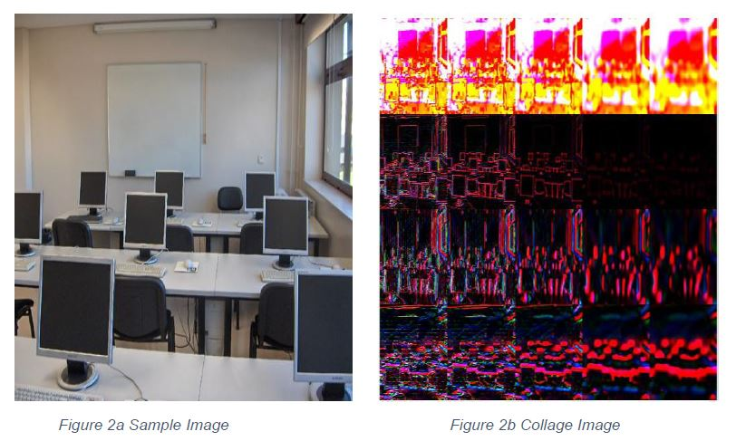
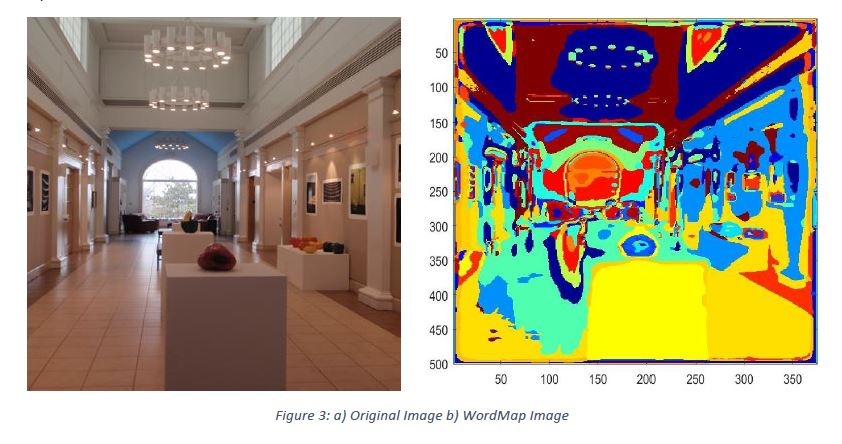
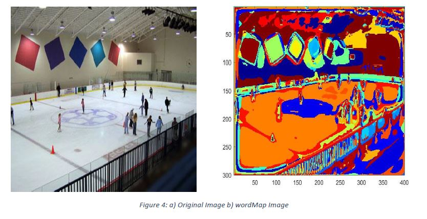
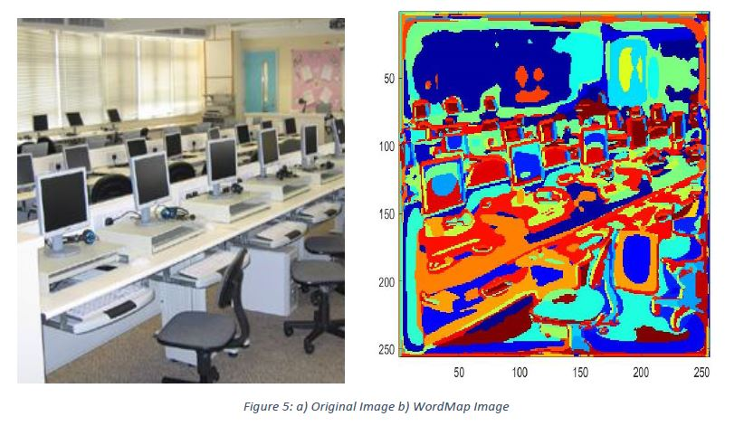
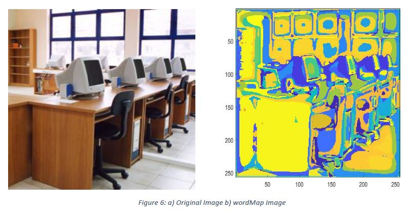
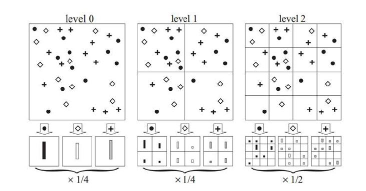
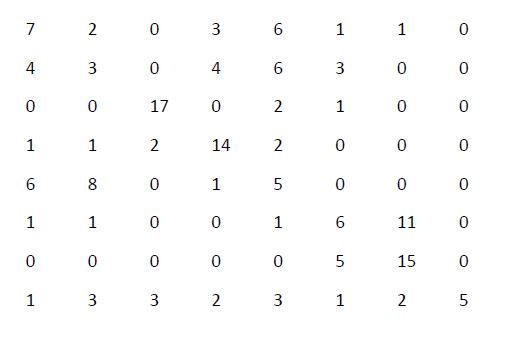

# Scene Classification using Spatial Pyramid Matching
Implemented a representation system based on bags of visual words and used spatial pyramid matching for classifying the scene categories.

## Getting Started
Following instructions will get you a copy of the project up and running on your local machine for development and testing purposes.

### Pre-requisites:
1. Matlab

### Steps to Setup:
1. **Clone the application**
```bash
git clone https://github.com/PrachiP23/Scene-Classification.git
```

2. **Word Representaion**
```bash
batchToVisualWords(n) where n- specify number of cores for parallel processing
```


3. **Evaluation**
```bash
run evaluateRecognitionSystem.m
```

4. **For identifying a single image:**
```bash
guessImage(absolutePathToimage)
```

## Description:

### Filter Bank


1. **Gaussian Filter:**
Gaussian filter a is low-pass filter. It suppresses high-frequency detail(noise), while preserving the low-frequency parts of the image. It basically blurs the image.  

2. **Laplacian Filter:**  
The Laplacian is used for edge detection as it detects the regions of high frequency changes.  

3. **Horizontal Scale:**  
The horizontal scale checks for the vertical edges.  
Filter: [-1 0 1]  
4. **Vertical Scale:**  
The vertical scale checks for the horizontal edges.  
Filter: [-1 0 1]'  

### Filter response
Extracted filter responses by applying filters in the filter bank on each image. After application of 20 filters on the sample image(fig a), an image collage(fig b) is generated.  


While applying the filters, the imfilter function is used for convolving the filters in filter bank with image. The filtering option mentioned in the function are:  
‘conv’: performs multidimensional filtering using convolution.  
‘same’: to keep the output size as the input size  
‘replicate’: in this case, the values of the pixel outside the image are determined by replicating its neighboring pixel value. The zero padding can cause the dark bands around the edges, whereas the replicate argument will eliminate this effect.  


### Dictionary
Generated a visual words dictionary by clustering response of random pixels from each image using k-means clustering algorithm. Each cluster represents a word.  

### WordMap
The wordmap images define the shapes of the object. Generated a wordmap for each image where each pixel is assigned to its closest visual word. The similar colors/shapes in the image are classified into similar categories or into bag of words.
For e.g., for the computer room category, we can see that the computer shape is defined in the wordmap and we can identify from its wordmap that it belongs to computer room.  
Below are a few images showing the original image and the wordMap image:  
1.   
2.   
3.   
4.   

### Building a Recognition system
1. **Feature Extraction**
Extract the histogram of visual words within the given image (i.e., the bag of visual words)

2. **Multi-resolution: Spatial Pyramid Matching**
Bag of words is simple and efficient, but it discards information about the spatial structure of the image and this information is often valuable. One way to alleviate this issue is to use spatial pyramid matching. The general idea is to divide the image into a small number of cells, and concatenate the histogram of each of these cells to the histogram of the original image, with a suitable weight.  
  

Built a recognition system that will guess the image by comparing histogram of the image with the training set of histograms.


### Evaluation: Confusion Matrix
  A confusion matrix is a table that is often used to describe the performance of a classification model  on a set of test data for which the true values are known. The following confusion matrix is generated:  
  

Accuracy is 45%.
